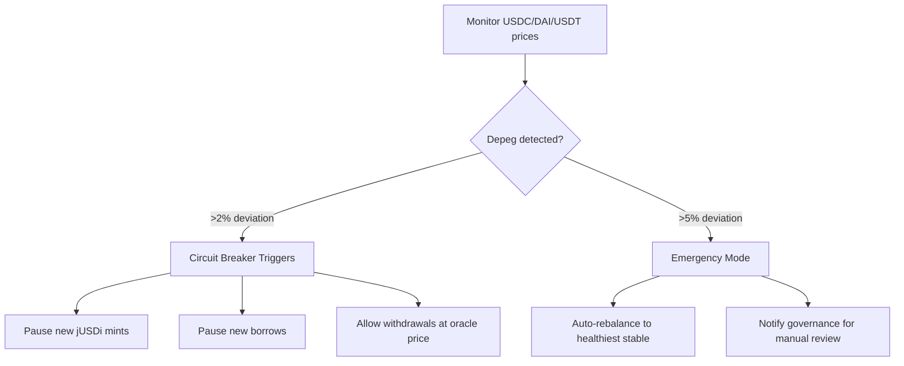

# Jubilee Protocol: Ecosystem Vision v2

**The DeFi Ecosystem Where Your Collateral Pays Off Your Loan**

---

## 🗓️ Launch Timeline

| Token | Asset Class | Launch | Status |
|-------|-------------|--------|--------|
| **jBTCi** | Bitcoin Index | Jan 7, 2026 | ✅ LIVE |
| **jETHs** | ETH Staking | Feb 7, 2026 | 🟡 Next |
| **jUSDi** | Stablecoin Yield | Mar 7, 2026 | ⏳ Planned |
| **Jubilee Lending** | Self-Repaying Loans | **Apr 3, 2026** | ⏳ Planned |

---

## 💡 Self-Repaying Loans (75% LTV)

### Collateral Parameters

| Collateral | LTV | Liquidation | Yield Source |
|------------|-----|-------------|--------------|
| jBTCi | **75%** | 80% | Rebalancing arb |
| jETHs | **75%** | 80% | Staking + LST arb |

### Example

```
Deposit:       10 jBTCi ($1M @ 8% APY)
Max Borrow:    $750,000 jUSDi (75% LTV)
Yield:         $80,000/year
Loan repaid:   ~9.4 years (from yield alone)
```

---

## 🛡️ Risk Management: Depeg Handling

### Stablecoin Depeg Protection



### Multi-Layer Protection

| Layer | Trigger | Action |
|-------|---------|--------|
| **1. Early Warning** | 1% deviation | Log event, increase monitoring |
| **2. Circuit Breaker** | 2% deviation | Pause mints/borrows |
| **3. Emergency Mode** | 5% deviation | Rebalance to healthy stables |
| **4. Governance** | 10%+ deviation | Manual intervention, potential wind-down |

### Stablecoin Diversification (jUSDi)

```
jUSDi backing:
├── 40% USDC  (Coinbase, regulated)
├── 30% DAI   (Decentralized, MakerDAO)
├── 20% USDT  (Liquidity, Tether)
└── 10% Buffer (Native yield reserve)
```

If USDT depegs → Auto-rebalance to USDC/DAI

---

## 🔷 jETHs: ETH Staking Index

### Underlying Assets

| LST | Provider | Est. APY | Weight |
|-----|----------|----------|--------|
| wstETH | Lido | 3.5-4% | 40% |
| cbETH | Coinbase | 3-3.5% | 35% |
| rETH | Rocket Pool | 3-4% | 25% |

### Yield Sources

1. **Base staking yield**: 3-4% from Ethereum PoS
2. **LST arbitrage**: Spread between LST prices
3. **Rebalancing**: Capture allocation drift

### Contract Architecture

```solidity
// YearnJETHsStrategy.sol - Key differences from jBTCi

// 18 decimals (not 8)
uint8 public constant DECIMALS = 18;

// Three assets instead of two
IERC20 public immutable WSTETH;
IERC20 public immutable CBETH;
IERC20 public immutable RETH;

// Configurable weights
uint256 public wstethWeight = 4000; // 40%
uint256 public cbethWeight = 3500;  // 35%
uint256 public rethWeight = 2500;   // 25%

// LST-specific oracles
IChainlinkOracle public immutable STETH_ETH_ORACLE;
IChainlinkOracle public immutable CBETH_ETH_ORACLE;
IChainlinkOracle public immutable RETH_ETH_ORACLE;
```

### Rebalancing Logic

```
IF wstETH allocation > 42% (target + 2%):
    Swap excess wstETH → underweight LST
    
IF cbETH price > 1.005 ETH (0.5% premium):
    Sell cbETH, buy discounted LST
```

---

## 🌐 Multi-Chain Architecture

| Chain | Purpose | Launch |
|-------|---------|--------|
| **Base** | Mainstream, liquidity, Farcaster | Q1 2026 |
| **zkSync L2** | Privacy, institutional | Q3 2026 |

---

## 📊 Deposit/Withdraw Safety

### Deposit Flow

```
User deposits cbBTC
    ↓
1. Input validation (min 0.001, max cap)
2. Allowance check
3. TransferFrom to strategy
4. Mint jBTCi shares
5. Emit event + refetch balances
```

### Withdraw Flow

```
User burns jBTCi
    ↓
1. Check share balance
2. Calculate proportional assets
3. Swap internal tokens if needed
4. Transfer cbBTC to user
5. Emit event + refetch balances
```

### Rate Limiting (already in jBTCi)

- Max daily swap: 2000 BTC
- Min rebalance interval: 1 hour
- Circuit breaker: 3 failed rebalances

---

## Next Steps

- [ ] **Feb 7**: Deploy jETHs to Base
- [ ] **Mar 7**: Deploy jUSDi to Base
- [ ] **Apr 3**: Launch Jubilee Lending (self-repaying loans)
- [ ] **Q2**: zkSync L2 deployment
